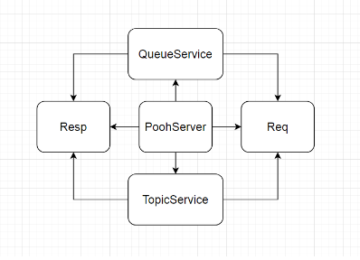

# job4j_pooh

В этом проекте мы сделаем аналог асинхронной очереди.
Приложение запускает Socket и ждет клиентов.
Клиенты могут быть двух типов: отправители (publisher), получатели (subscriber).
В качестве клиента будем использовать cURL. https://curl.se/download.html
В качестве протокола будем использовать HTTP. 

# Архитектура проекта

- Req - класс, служит для парсинга входящего запроса;
- httpRequestType - GET или POST. Он указывает на тип запроса;
- poohMode - указывает на режим работы: queue или topic;
- sourceName - имя очереди или топика;
- param - содержимое запроса.